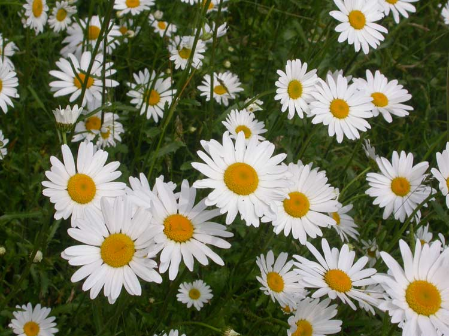
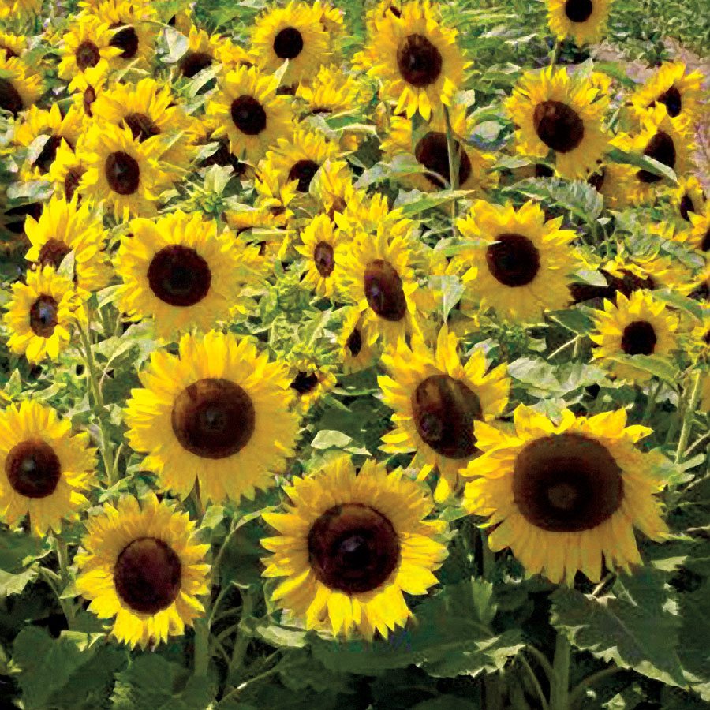

##  TensorFlow
Duration: 0:30

[TensorFlow](https://www.tensorflow.org/) es una librería especializada en aprendizaje de máquina.


### Que vamos a hacer

En este laboratorio vamos a usar TensorFlow para crear una aplicación que identifique objetos a partir de imagenes. 
>

  ```
  Evaluation time (1-image): 0.110s

  daisy (score=0.99712)
  tulips (score=0.00286)
  dandelion (score=0.00001)
  roses (score=0.00001)
  sunflowers (score=0.00000)
  ```

### What you'll Learn
* Como usar Colaboratory con Python y TensorFlow para entrenar un clasificador de imagenes
* Como clasificar imagens con el algoritmo entrenado

## Configuración
Duration: 0:30

### Instalar TensorFlow

Vamos a utilzar Colaboratory porque la configuración del ecosistema de programación, incluyendo la librería `tensorflow` y el acceso a un procesador gráfico GPU no requieren de ninguna configuración avanzada. La librería `tensorflow` está disponible en el sistema de Colaboratory de forma directa. El siguiente enlace los llevará a una libreta donde podrán evaluar el código de este laboratorio: [Sem3_Lab1_Entrenamiento.ipynb](https://colab.research.google.com/drive/132BaEyPn08mNrZKWisuwjsIJT5aFcUxi)


```python
import tensorflow as tf
print(tf.__version__)
```

    1.13.1
    

### Clonar el repositorio
En la libreta anterior, escriban el siguiente código que descarga los programas que se van a utilzar en este y el siguiente laboratorio. Los programas estaán alojados en un repositorio en GitHub. Clona el repositorio y una vez hecho, cambia la ruta a ese directorio, que es en el cual estaremos trabajando.


```python
!git clone https://github.com/htapiagroup/tensorflow-for-lania
```

    Cloning into 'tensorflow-for-lania'...
    remote: Enumerating objects: 422, done.
    remote: Total 422 (delta 0), reused 0 (delta 0), pack-reused 422
    Receiving objects: 100% (422/422), 59.91 MiB | 11.31 MiB/s, done.
    Resolving deltas: 100% (156/156), done.
    


```python
cd tensorflow-for-lania/
```

    /content/tensorflow-for-lania
    

Antes de entrenar un modelo, necesitamos datos con las categorias que quisieramos que el modelo pudiera identificar. El siguiente comando descarga una base de datos con imagenes de flores.


```python
!curl http://download.tensorflow.org/example_images/flower_photos.tgz \
    | tar xz -C tf_files
```

      % Total    % Received % Xferd  Average Speed   Time    Time     Time  Current
                                     Dload  Upload   Total   Spent    Left  Speed
    100  218M  100  218M    0     0  37.9M      0  0:00:05  0:00:05 --:--:-- 50.3M
    


```python
ls tf_files/flower_photos
```

    daisy/  dandelion/  LICENSE.txt  roses/  sunflowers/  tulips/
    

## (Re)entrenando la red neuronal
Duration: 5:00

### Configura MobileNet
En este laboratorio usaremos [MobileNet](https://research.googleblog.com/2017/06/mobilenets-open-source-models-for.html), una red neuronal ligera y eficiente. Esta red puede configurarse de dos formas:

* Resolucion de la imagen de entrada: Si las imagenes que alimentan al modelo son de mayor resolucion, necesitamos mayor poder de procesamiento y el modelo clasifica con mayor exactitud
* Tamaño relativo del modelo: 1.0, 0.75, 0.50 o 0.25.

Vamos a usar 224 y 0.50 para este laboratorio. 


```bash
%%bash
 
IMAGE_SIZE=224
ARCHITECTURE="mobilenet_0.50_${IMAGE_SIZE}"

python -m scripts.retrain \
  --bottleneck_dir=tf_files/bottlenecks \
  --how_many_training_steps=500 \
  --model_dir=tf_files/models/ \
  --summaries_dir=tf_files/training_summaries/"${ARCHITECTURE}" \
  --output_graph=tf_files/retrained_graph.pb \
  --output_labels=tf_files/retrained_labels.txt \
  --architecture="${ARCHITECTURE}" \
  --image_dir=tf_files/flower_photos
```

Este paso puede demorar varios minutos.

El script descarga un modelo pre-entrenado, agrega una nueva capa final y entrena esta capa en el conjunto de entrenamiento de las imagenes que descargaste previamente.

El modelo que acabamos de usar no tiene ninguna de las especies de flores que hemos especificado. Sin embargo, la informacion que hace posible que el modelo pueda distinguir entre 1000 clases de objetos puede usarse para nuestros propositos. Toda esta informacion es usada inicialmente para alimentar una red neuronal cuya ultima capa de clasificacion distingue entre las clases de flores.

## Usando el nuevo modelo
Duration: 5:00

El script de reentrenamiento guarda los datos en los siguientes archivos:
  * `tf_files/retrained_graph.pb`, que contiene una version de la red neuronal con la capa final reentrenada usando las nuevas categorias,
  * `tf_files/retrained_labels.txt`, un archivo de texto que contiene las etiquetas

## Clasificando una imagen
Duration: 2:00


```python
#@markdown En el directorio `scripts` hay un codigo que puede usarse para probar el modelo con la instruccion que sigue
from IPython.display import YouTubeVideo, display
from IPython.display import Image
display(Image(filename="tf_files/flower_photos/daisy/301964511_fab84ea1c1.jpg",  width=224, height=170))
```


```python
%run scripts/label_image.py \
 --graph=tf_files/retrained_graph.pb  \
 --image=tf_files/flower_photos/daisy/301964511_fab84ea1c1.jpg

```

    
    Evaluation time (1-image): 0.174s
    
    daisy (score=0.99732)
    tulips (score=0.00268)
    sunflowers (score=0.00000)
    dandelion (score=0.00000)
    roses (score=0.00000)
    

### Parentesis (...
Tambien puede evaluarse usando la siguiente sintaxis


```python
!python -m scripts.label_image \
    --graph=tf_files/retrained_graph.pb  \
    --image=tf_files/flower_photos/daisy/301964511_fab84ea1c1.jpg
```

Adicionalmente la sintaxis que sigue tambien funciona


```python
%%python

scripts.label_image \
    --graph=tf_files/retrained_graph.pb  \
    --image=tf_files/flower_photos/daisy/301964511_fab84ea1c1.jpg
```

## Ejemplos adicionales tomados del conjunto de entrenamiento
Duration: 2:00

En cada ejecucion se va a mostrar una lista de flores, en la mayoria de los casos con la flor correcta en la primera linea. En este caso el resultado indica que con un 99.017% de probabilidad, la imagen representa una flor "daisy" (margarita). Podemos usar este script cambiando la ruta del archivo en la opcion `--image` para determinar que flor hay en alguna imagen:


```python
display(Image(filename="tf_files/flower_photos/roses/2888138918_402096c7fb.jpg"))
%run scripts/label_image.py \
    --graph=tf_files/retrained_graph.pb  \
    --image=tf_files/flower_photos/roses/2888138918_402096c7fb.jpg
```


    
    Evaluation time (1-image): 0.117s
    
    roses (score=0.99463)
    tulips (score=0.00534)
    sunflowers (score=0.00002)
    daisy (score=0.00001)
    dandelion (score=0.00000)
    


```python
display(Image(filename="tf_files/flower_photos/roses/2863863372_605e29c03e_m.jpg"))
%run scripts/label_image.py \
    --graph=tf_files/retrained_graph.pb  \
    --image=tf_files/flower_photos/roses/2863863372_605e29c03e_m.jpg

```


    
    Evaluation time (1-image): 0.116s
    
    roses (score=0.99370)
    tulips (score=0.00382)
    daisy (score=0.00222)
    sunflowers (score=0.00023)
    dandelion (score=0.00005)
    

## Probando con imagenes nuevas
Duration: 2:00

Vamos a probar usando imagenes de flores que el modelo no conoce. Para esto hacemos una busqueda rapida en 


```python
!wget http://expertofdreams.com/data_images/daisy/daisy-7.jpg
  
```


```python
display(Image(filename="daisy-7.jpg", width=128, height=128))
%run scripts/label_image.py \
    --graph=tf_files/retrained_graph.pb  \
    --image=daisy-7.jpg
```





    
    Evaluation time (1-image): 0.170s
    
    daisy (score=0.99950)
    sunflowers (score=0.00047)
    tulips (score=0.00003)
    roses (score=0.00000)
    dandelion (score=0.00000)
    


```python

!wget https://parkseed.com/images/xxl/00989-pk-p1.jpg

display(Image(filename="00989-pk-p1.jpg", width=128, height=128))
%run scripts/label_image.py \
    --graph=tf_files/retrained_graph.pb  \
    --image=00989-pk-p1.jpg

```

    --2019-03-13 16:47:23--  https://parkseed.com/images/xxl/00989-pk-p1.jpg
    Resolving parkseed.com (parkseed.com)... 205.147.88.160
    Connecting to parkseed.com (parkseed.com)|205.147.88.160|:443... connected.
    HTTP request sent, awaiting response... 200 OK
    Length: 515685 (504K) [image/jpeg]
    Saving to: ‘00989-pk-p1.jpg.2’
    
    00989-pk-p1.jpg.2   100%[===================>] 503.60K   905KB/s    in 0.6s    
    
    2019-03-13 16:47:25 (905 KB/s) - ‘00989-pk-p1.jpg.2’ saved [515685/515685]
    
    





    
    Evaluation time (1-image): 0.173s
    
    sunflowers (score=0.99999)
    dandelion (score=0.00000)
    roses (score=0.00000)
    daisy (score=0.00000)
    tulips (score=0.00000)
    


```python
!wget http://barmac.com.au/wp-content/uploads/sites/3/2016/01/dandelion.jpg


display(Image(filename="dandelion.jpg", width=128, height=128))
%run scripts/label_image.py \
    --graph=tf_files/retrained_graph.pb  \
    --image=dandelion.jpg

```

    --2019-03-13 16:47:45--  http://barmac.com.au/wp-content/uploads/sites/3/2016/01/dandelion.jpg
    Resolving barmac.com.au (barmac.com.au)... 110.173.158.130
    Connecting to barmac.com.au (barmac.com.au)|110.173.158.130|:80... connected.
    HTTP request sent, awaiting response... 200 OK
    Length: 73936 (72K) [image/jpeg]
    Saving to: ‘dandelion.jpg.1’
    
    dandelion.jpg.1     100%[===================>]  72.20K   171KB/s    in 0.4s    
    
    2019-03-13 16:47:45 (171 KB/s) - ‘dandelion.jpg.1’ saved [73936/73936]
    
    


    
    Evaluation time (1-image): 0.167s
    
    dandelion (score=0.99750)
    sunflowers (score=0.00211)
    daisy (score=0.00039)
    tulips (score=0.00000)
    roses (score=0.00000)
    

## Retroalimentación
Duration: 1:00

Survey
: TensorFlow es una libreria
 - para calculos numericos de matrices aleatorias
 - para calculos numericos especilizada en aprendizaje de maquina
 - con articulos de superacion personal
 - de flujos operacionales 
: El numero que arroja nuestro modelo reentrenado junto a la etiqueta
 - indica el marcador de la ultima serie del caribe
 - indica el porcentaje de confidencia del modelo en que la imagen representa la clase indicada por la etiqueta
 - indica un marcador que no significa nada
 
## Entregas
Duration: 1:00

Las entregas se especifican empezando con el nombre del archivo y la descripción del contenido.

positive
: 1. Sem3Lab1_classify.gif: Captura de pantalla con una imagen clasificada por el algrotimo contruido (Paso 4, 5, 6)
2. Sem3Lab1_classify2.gif: Captura de pantalla con una imagen nueva obtenida por ustedes para cada una de las clases indicadas y clasificada por el algrotimo contruido (Paso 7)


```python
!wget https://www.producemarketguide.com/sites/default/files/Commodities.tar/Commodities/strawberries_commodity-page.png
```


```python
display(Image(filename="strawberries_commodity-page.png", width=64, height=64))
%run scripts/label_image.py \
    --graph=tf_files/retrained_graph.pb  \
    --image=strawberries_commodity-page.png

```


    
    Evaluation time (1-image): 0.124s
    
    daisy (score=0.94212)
    tulips (score=0.03844)
    roses (score=0.01617)
    sunflowers (score=0.00306)
    dandelion (score=0.00020)
    
